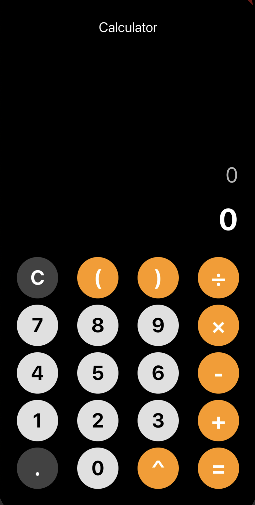

# 🧮 Modern Calculator App (Pro1)

Eine elegante, minimalistische und performante Taschenrechner-App, entwickelt mit **Flutter** und **Dart**. Das Projekt zeichnet sich durch ein sauberes, modernes User Interface (UI) und eine intuitive Benutzerführung aus. Entwickelt, um grundlegende mathematische Operationen zuverlässig und stilvoll zu lösen.

---

## 📱 Eindruck & Design

> 💡 **Hinweis für Recruiter:** Da du die App hier im Browser nicht direkt live testen kannst, findest du untenstehend einen Einblick in das Interface. Du kannst dir die fertige App zudem direkt als installierbare Datei auf dein Android-Gerät laden (siehe [Releases](#-installation--apk-download)).

| Hauptansicht (Light / Minimal Mode) |
| :---: |
|  <br> *Sauberes Grid-Layout mit harmonischen Farbkontrasten für optimale Lesbarkeit.* |


---

## ✨ Features

* **Grundrechenarten:** Zuverlässige Berechnung von Addition, Subtraktion, Multiplikation und Division.
* **Erweiterte Basis-Funktionen:** Unterstützung für Prozentrechnung (`%`), Vorzeichenwechsel (`+/-`) und schnelles Löschen (`C`).
* **Pixel-Perfect UI:** Ein modernes, abgerundetes Button-Grid-Layout, inspiriert von aktuellen Design-Trends (Neumorphismus/Minimalismus).
* **Responsive Layout:** Dynamische Anpassung der Tastengrößen an verschiedene Bildschirmgrößen (Smartphones & Tablets).
* **Fehler-Handling:** Schutz vor typischen Fehlern (z. B. Division durch Null).

---

## 🛠️ Tech Stack & Architektur

* **Framework:** [Flutter](https://flutter.dev/) (SDK ^3.11.5)
* **Programmiersprache:** [Dart](https://dart.dev/)
* **UI-Standard:** Material Design 3 mit benutzerdefinierten, abgerundeten Oberflächenkomponenten.
* **Code-Qualität:** Striktes Linting durch `flutter_lints` zur Gewährleistung von sauberem, wartbarem und standardkonformem Quellcode.

---

## 📦 Installation & APK-Download

### Für Endnutzer (Direkt auf dem Smartphone testen)
Falls du ein Android-Gerät besitzt, kannst du die fertig kompilierte App direkt ausprobieren:
1. Gehe rechts im Menü auf **[Releases](https://github.com/MrMetal55/pro1/releases)**.
2. Lade dir die aktuelle `app-release.apk` herunter.
3. Öffne die Datei auf deinem Smartphone und installiere sie (ggf. "Installation aus unbekannten Quellen" erlauben).

### Für Entwickler (Lokales Setup)
Um das Projekt lokal zu starten oder weiterzuentwickeln, folge diesen Schritten:

1. **Repository klonen:**
   ```bash
   git clone [https://github.com/MrMetal55/pro1.git](https://github.com/MrMetal55/pro1.git)
   cd pro1
